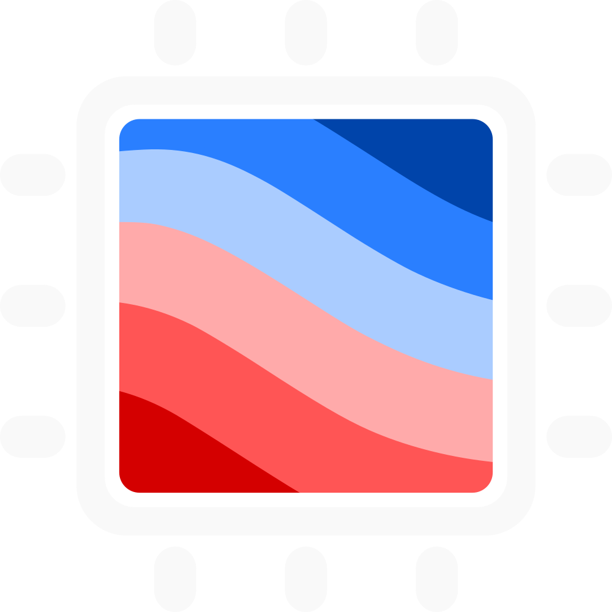

<section>
<h2>Communities</h2>

I'm proud of being part of these awesome communities:

    

        <a href="https://www.fatiando.org">
            
            <h3>Fatiando a Terra</h3>
        </a>
    

    

        <a href="https://www.compgeolab.org">
            
            <h3>Computer-Oriented Geoscience Lab</h3>
        </a>
    

    

        <a href="https://geolatinas.weebly.com/">
            
            <h3>Geolatinas</h3>
        </a>
    

    

        <a href="https://softwareunderground.org/">
            
            <h3>Software Underground</h3>
        </a>
    

    

        <a href="https://carpentries.org/">
            
            <h3>The Carpentries</h3>
        </a>
    

</section>
